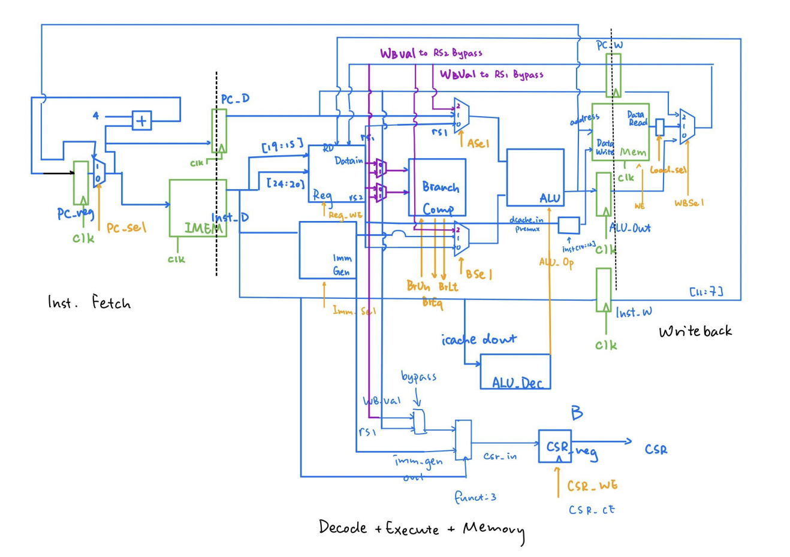

# Project Review: EECS151_ASIC_CPU

This is a review of the Verilog CPU me and Yichuan Ding co-designed and developed in EECS151 ASIC lab.

## Skeleton Code

Almost all module file is provided with a port skeleton, except for memloader.v, Cache.v, and RISC-V control.v. The top module, and a pretty extensive test are also predefined and can be used for our convenience.

As a result, it is unfair to say we "developed a CPU from scratch". We have a crazily solid foundation abefore we start actually implementing anything. 

## Design Decisions

We were tasked to design a three-stage pipelined CPU. Many other folks in our lab decided to directly persue a five-stage CPU in order to win that non-existing apple competition : /. Still, we decided to go for a simpler three-stage pipline because it will be a lot easier to debug and have way less hazards to consider.

The diagram above is the pipeline diagram we ended up using for the final design. In the initial design, we have IF, D+E, and M+WB. However, we later found out the need to put the DMEM on the brink of two pipeline stages because it is a clocked component and doesn't support asynchronous read. So we ended up having to put IMEM and DMEM on the edge between two stages to save cycles and improve performance.

A very cool part to brag about this design is the special PC register logic in the Instruction Fetching stage. We have designed it so that the mux chooses PC or the branch/jump target to feed into the IMEM and PC_D register, but the PC_reg updates its value based on either PC+4 or target+4. This way, we can (brilliantly) avoid any control hazards from branching or jump and thus avoid writing any logic for branch prediction. This design has the additional benefit of not needing to reset the PC_reg to target-4, so we kept the entire system intuitive and readable.

## ALU

The first task is to design an ALU for this CPU. This is supposed to be a fairly easy task. It is mainly constituted of case and if statements. One thing we didn't debug was the SRA. Verilog only treats a shift right to be arithmetic if the number to be shifted is explicitly signed. Otherwise it will still be a logical shift, even if you used >>> instead of >> for the shift. The key difference is that SRA will put in signed bits to the left, whereas SRL will only put a bunch of zeroes. 

## Datapath and Control

Writing the datapath and the control logic is utterly simple. All the components are explicitly drawn, and connections are out there as well. It is more of a labor than an intellectual work to just to code down the stream. 

However, because we firstly had no idea what is a CSR(Control Status Register) and decided to ignore it for now, we ran into the middle of nowhere for quite a while. Turns out the test programs utilizes the CSR to check for errors. 

After finishing up the CSR, it is just a matter of labor work again to fix up the rest of the code. Of course we make terrible coding mistakes along the way, so we must do test-oriented programming, finding and fixing them manually. We fixed them in the order of arithmetic operations => load word => the rest of load instructions => store instructions. This part of debugging only took about a weekend, so it is quite a breeze comparing to what's coming next.

## Cache

Cache is where we suffered the most for sure. We were asked to designa dn implement a 